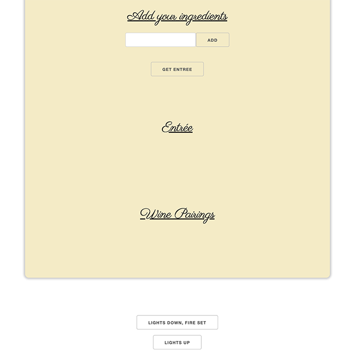
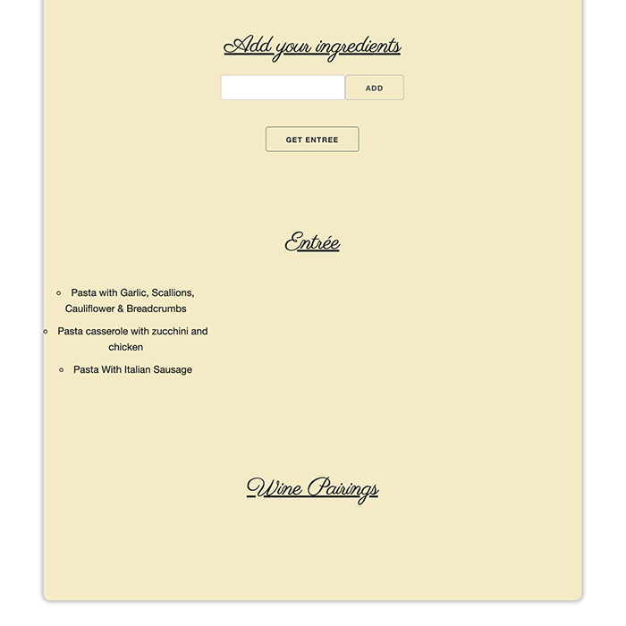
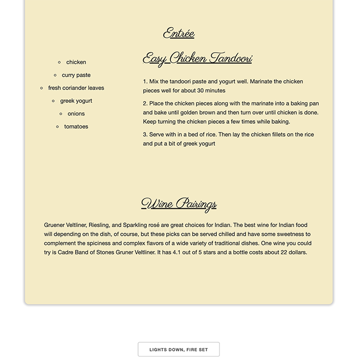

# Provisions

## Description

**Provisions** is an application that generates entreé and wine pairings inspired by ingredients, one’s provisions, inputted by the user. Who knew one day as a result of a deadly global pandemic, we’d take for granted the simple pleasure of dining out? **Provisions** is inspired by enjoying a meal anywhere other than your own home and making the best out of a 2020/2021-situation.

## Usage
- Enter 2 ingredients to your ingredients list on at a time by clicking add. 
- Click 'Get Entreé' to generate recipe recommendations and wine pairings.
- Turn the lights down and set the fire to enjoy your provisions by clicking 'Lights Down, Fire Set'.

## Features
- Ingredients input area
- Entreé recommendation generator
- Entreé selection
- Wine pairing generator
- Spoonacular api technologies
- Youtube api technologies

### Credits
Original App:
 - J Brennan https://github.com/legit-jb
 - Jared de Uriarte https://github.com/jareddeuriarte
 - Peter MoDavis https://github.com/PeterMoDavis
 
Refactored by:
  J Brennan

## Deployed Site
https://github.com/legit-jb

## Github Site
https://github.com/legit-jb/provisions
